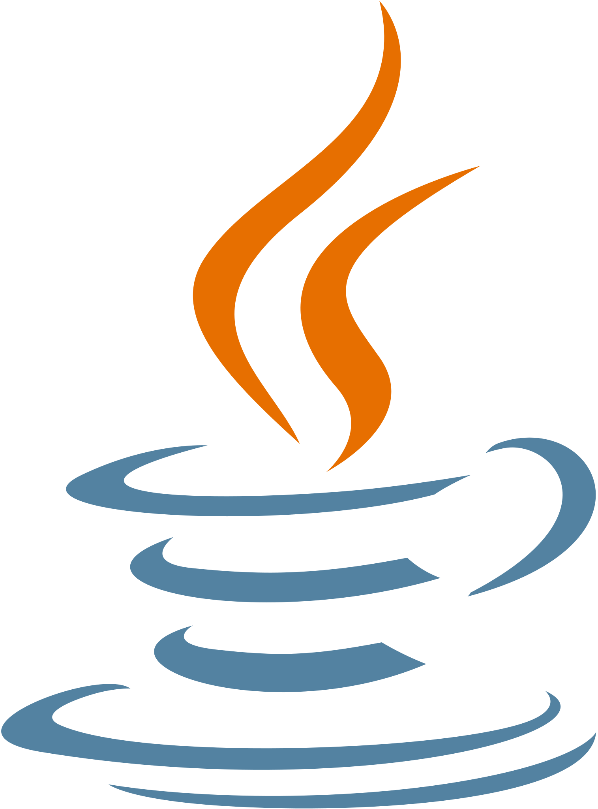
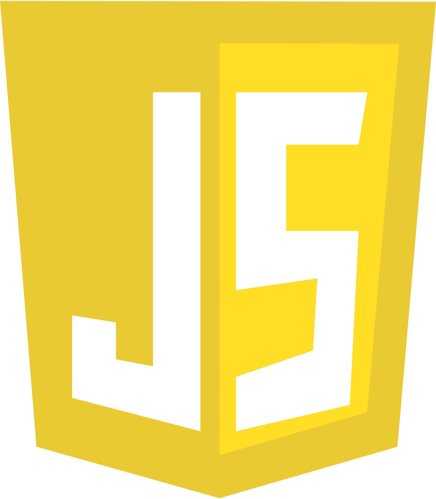
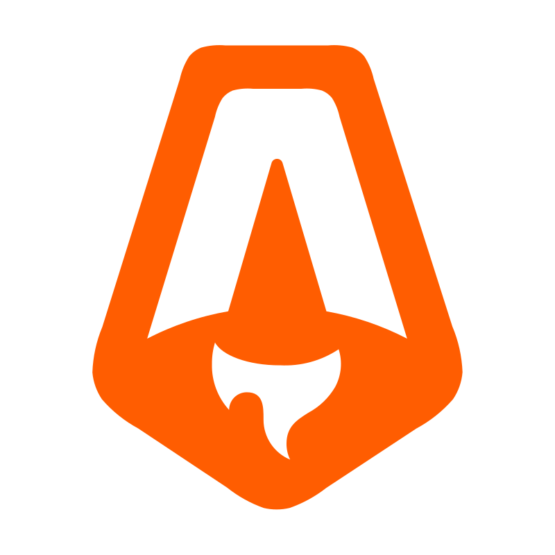
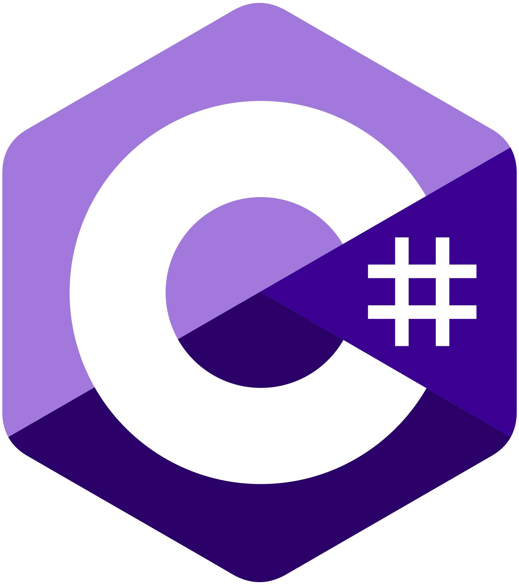
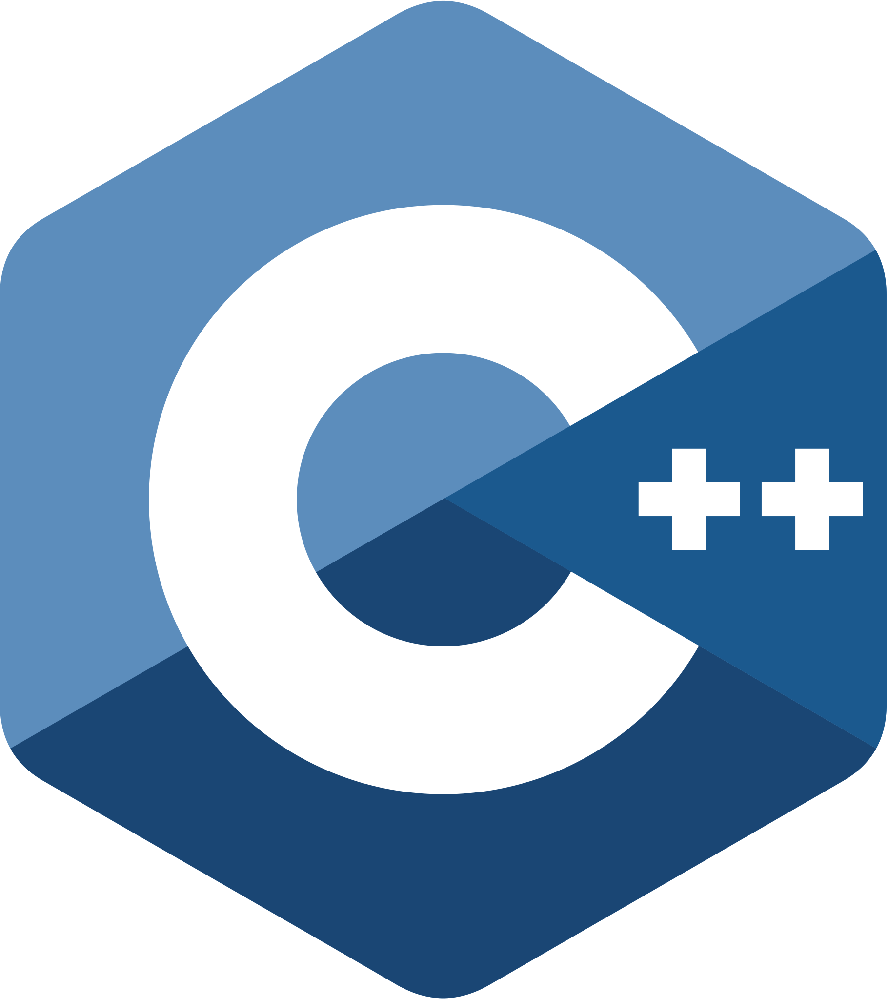

### 

---

### 🛠️Currently learning.
  <ul>
    <li> Java</li>
    <li> Python</li>
    <li> JavaScript</li>
    <li> Astro</li>
    <li> Tailwind</li>
    <li> TypeScript</li>
  </ul>
  
---

### 🖥️ Tools I want to learn.

  <ul>
    <li> React</li>
    <li> Next.js</li>
    <li> Laravel</li>
    <li> Bootstrap</li>
  </ul>

---
    
  ### 👾 Programming languages I want to learn.
  <ul>
    <li> Php</li>
    <li> C# /  C++</li>
  </ul>
